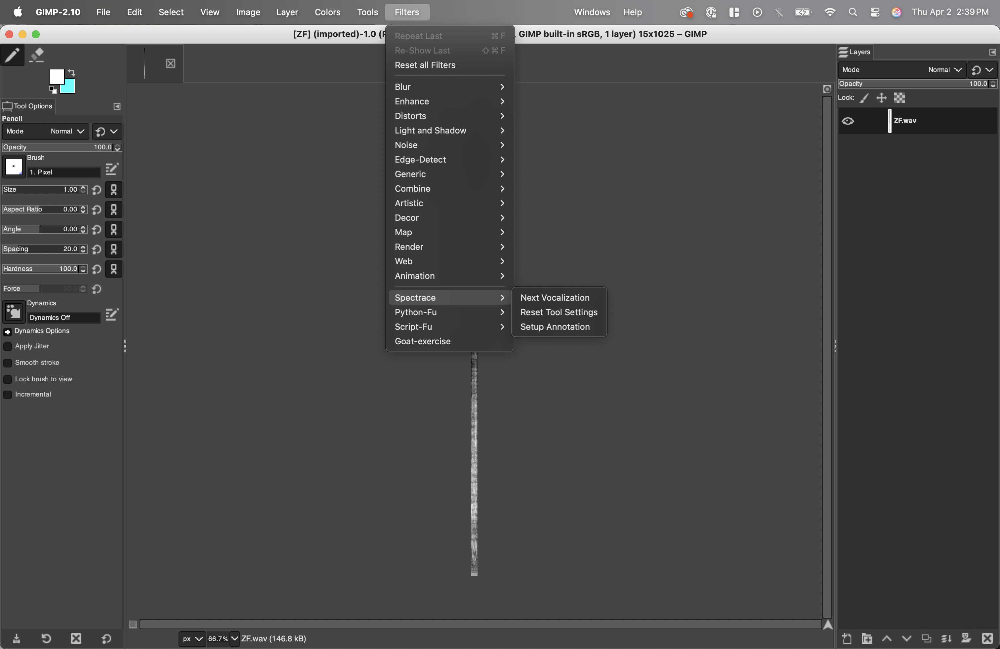
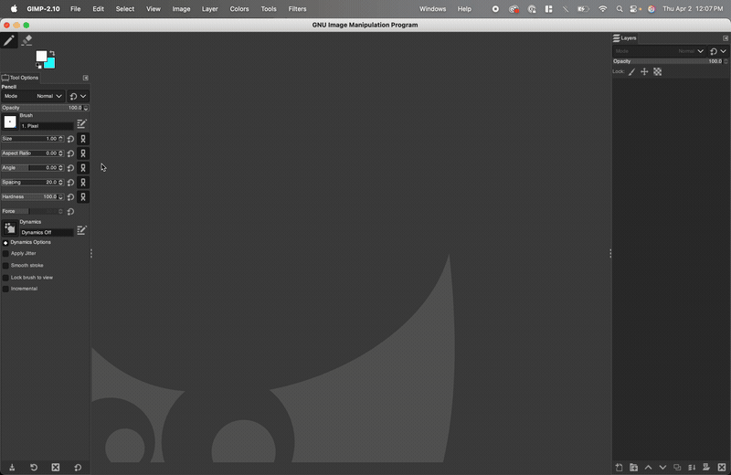
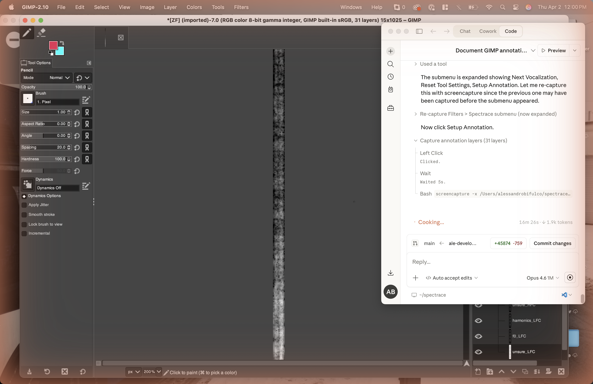
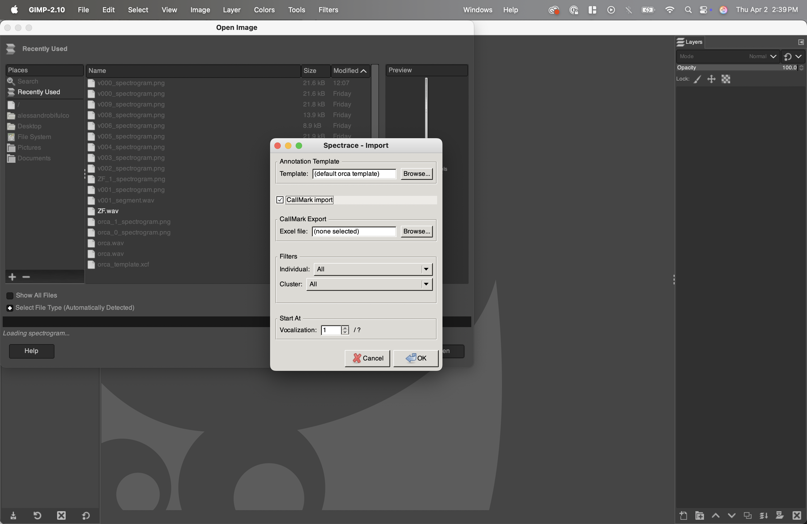
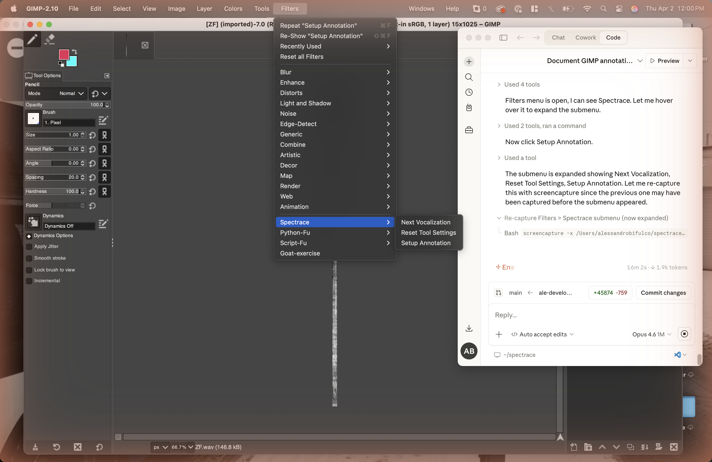

# Spectrace

A Python-based workflow for creating precise binary mask annotations on spectrograms using GIMP, designed primarily for bioacoustic research applications.

## Overview

Spectrace streamlines the process of annotating audio spectrograms by combining Python's audio processing capabilities with GIMP's intuitive layer-based drawing interface. The workflow allows researchers to:

1. Open a WAV file directly in GIMP (automatic spectrogram generation)
2. Draw detailed binary masks on spectrograms using GIMP's tools
3. Organize annotations using layer groups (e.g., fundamental frequency, harmonics, heterodynes)
4. Export annotations to multiple formats (XCF, HDF5, Excel)
5. Visualize and validate annotations programmatically

This tool is particularly useful for creating training datasets for machine learning models, analyzing vocalizations, or documenting acoustic features with pixel-level precision.

## Key Features

- **WAV File Handler**: Open WAV files directly in GIMP — the plugin automatically generates and loads the spectrogram (no command-line steps needed)
- **CallMark Import**: Import vocalization onset/offset data from CallMark Excel exports, filter by individual and cluster, and navigate through vocalizations one-by-one inside GIMP
- **One-Click Annotation Setup**: `Filters > Spectrace > Setup Annotation` creates all 26 annotation layers, configures tools, and starts the background monitor
- **Tool Enforcement**: The plugin continuously enforces correct pencil settings (1px, hardness 100, dynamics off) so annotators cannot accidentally misconfigure the tools
- **Auto Color Switching**: Each annotation layer gets a unique foreground color automatically — switching layers changes the drawing color
- **Dynamic Templates**: Use any XCF file as a template, or fall back to the built-in orca template
- **Locked-Down UI**: The installer strips GIMP down to essentials (pencil + eraser only, minimal keyboard shortcuts) to prevent accidental operations
- **Heterodyne Validation**: Validate annotated heterodyne contours against predicted frequencies computed from HFC/LFC fundamentals using IoU and contour-level metrics
- **Multiple Export Formats**: Convert annotations to HDF5 for ML pipelines or Excel for spreadsheet analysis
- **Batch Visualization**: Generate overlay and individual layer visualizations across all projects

---

## Installation

### Step 1: Install GIMP 2.10

> **IMPORTANT:** You must install GIMP version **2.10.x** — not GIMP 3.0 or later. The `gimpformats` Python library and the Spectrace plugin both require GIMP 2.10. **Do not install 3.0**


**macOS:**

Download the `.dmg` from the [Spectrace releases page](https://github.com/JacobGlennAyers/spectrace/releases/tag/correct_gimp_version). Alternatively:

```bash
brew install gimp@2.10
```

**Windows:**

1. Download `gimp-2.10.30-setup.exe` from the [Spectrace releases page](https://github.com/JacobGlennAyers/spectrace/releases/tag/correct_gimp_version)
2. Run the installer and accept default settings

**Linux (Ubuntu/Debian):**

```bash
sudo apt update && sudo apt install gimp=2.10.*
```

If GIMP 2.10 is not in your distribution's repositories, use Flatpak:

```bash
flatpak install flathub org.gimp.GIMP//2.10
flatpak run org.gimp.GIMP//2.10
```

**After installing, launch GIMP once and then close it.** This creates the configuration directory that the Spectrace installer needs.

### Step 2: Clone the Repository and Create the Conda Environment

```bash
git clone https://github.com/JacobGlennAyers/spectrace.git
cd spectrace
conda env create -f environment.yml
conda activate spectrace
```

This installs all Python dependencies:

| Package | Purpose |
|---------|---------|
| librosa | Audio processing and spectrogram generation |
| numpy, pandas | Data manipulation |
| matplotlib | Visualization |
| gimpformats | Reading GIMP 2.10 XCF files |
| h5py | HDF5 file handling |
| pillow | Image processing |
| openpyxl | Excel export |
| scikit-learn | ML utilities |

### Step 3: Install the Spectrace GIMP Plugin

Run the installer (works on macOS, Linux, and Windows):

```bash
python gimp_plugin/install.py
```

The installer automatically:
1. Copies the plugin into GIMP's plug-ins directory
2. Installs a locked-down UI configuration (pencil + eraser only, minimal keyboard shortcuts)
3. Detects your conda `spectrace` environment and writes the path to `~/.spectrace/config.json`
4. Backs up your original GIMP configuration (restored when you uninstall)

> **Note:** The Linux installer auto-detects both standard (`~/.config/GIMP/2.10`) and Flatpak GIMP installations.

### Step 4: Verify the Installation

1. **Close GIMP completely** if it's open (the plugin only loads at startup)
2. **Reopen GIMP**
3. You should see a stripped-down interface: only Pencil and Eraser in the toolbox, only Tool Options and Layers panels
4. Right-click the canvas and check that `Filters > Spectrace` appears with three entries:
   - `Next Vocalization` (active during CallMark sessions)
   - `Reset Tool Settings`
   - `Setup Annotation`



---

## Quick Start Guide

The Spectrace plugin eliminates all manual GIMP setup. There are two import workflows:

- **Standard Import**: Open a WAV file, annotate the full spectrogram
- **CallMark Import**: Load a CallMark Excel export, filter by individual/cluster, and navigate through vocalizations one-by-one

Both workflows end the same way: draw contours on annotation layers, save.

### GIF Demonstrations

**Full workflow demo (CallMark import):**


---

### Workflow A: Standard Import

**Open WAV** &rarr; **Setup Annotation** &rarr; **Draw** &rarr; **Save**

#### 1. Open Your WAV File in GIMP

1. In GIMP, go to `File > Open`
2. Navigate to your WAV audio file and select it
3. The **Spectrace - Import** dialog appears
4. Leave the **CallMark import** checkbox unchecked
5. Optionally browse to a custom template XCF, or leave it as `(default orca template)`
6. Click OK

The plugin automatically:
- Generates a spectrogram using librosa (via the `spectrace` conda environment)
- Creates a project folder in `projects/` with the spectrogram PNG and metadata
- Loads the spectrogram into GIMP

> **Tip:** You can open any WAV file from anywhere on your computer. The plugin creates the project folder automatically.

> **Note:** If you open the same WAV file again, the plugin reuses the most recent existing spectrogram instead of regenerating it.

#### 2. Set Up Annotation Layers

1. Go to `Filters > Spectrace > Setup Annotation`
2. The plugin creates the full annotation layer hierarchy (all 26 layers with correct grouping), sets the Pencil tool to correct settings (1px, hardness 100, dynamics off), and starts a background monitor that enforces tool settings and auto-switches foreground colors when you change layers



**You are now ready to draw.**

#### 3. Draw Your Annotations

1. **Expand the layer group** in the Layers panel (click the `+` icon next to `OrcinusOrca_FrequencyContours`)
2. **Click on a layer** to select it (e.g., `f0_LFC` for fundamental frequency) — the foreground color changes automatically
3. **Zoom in** for precision: use `View > Zoom > 2:1 (200%)` or scroll-wheel zoom
4. **Draw** along the frequency contour on the spectrogram — the Pencil tool is already configured
5. **Switch to Eraser** when you need to correct — the eraser size is adjustable and remembered across tool switches

**Drawing Tips:**
- Switch layers by clicking layer names in the Layers panel — the color updates automatically
- Toggle layer visibility using the "eye" icon to check your work
- If the pencil stops working correctly, use `Filters > Spectrace > Reset Tool Settings`
- Use `Ctrl+Z` (`Cmd+Z` on Mac) to undo mistakes

**What to Draw:**
- Draw all contours within the onset and offset boundaries of the vocalization
- If multiple calls from the **same vocalization** are present, draw them all in one project
- If calls from **different individuals/vocalizations** are present, create separate projects for each

#### 4. Save Your Work

1. `File > Save As...` (first time) or `Ctrl+S` (subsequent saves)
2. Save the XCF file in your project folder: `projects/your_audio_file_0/your_audio_file_0.xcf`
3. The XCF filename should match the project folder name

---

### Workflow B: CallMark Import

**Open WAV** &rarr; **Select Excel + Filters** &rarr; **Setup Annotation** &rarr; **Draw** &rarr; **Next Vocalization** &rarr; **Repeat**

CallMark import is designed for batch annotation of vocalizations catalogued by [CallMark](https://github.com/paladinprime/callmark). It segments a long recording into individual vocalizations using onset/offset times from a CallMark Excel export, and lets you navigate through them one-by-one inside GIMP.

#### 1. Open Your WAV File and Configure CallMark

1. In GIMP, go to `File > Open` and select your WAV file:


2. In the **Spectrace - Import** dialog, check **CallMark import**
3. Click **Browse...** next to "Excel file" and select your CallMark `.xlsx` export
4. The plugin parses the Excel file and populates the filter dropdowns:



5. **Filter by Individual**: Select a specific individual ID or leave as "All"
6. **Filter by Cluster**: Select a specific cluster name or leave as "All"
7. The vocalization count updates live as you change filters
8. **Start At**: Optionally set the starting vocalization number (useful for resuming work)
9. Click OK

The plugin generates a spectrogram for the first vocalization and loads it into GIMP.

#### 2. Set Up Annotation Layers and Draw

Same as the standard workflow:
1. Go to `Filters > Spectrace > Setup Annotation`
2. Draw your contours on the annotation layers

#### 3. Navigate to the Next Vocalization

When you finish annotating a vocalization:

1. Go to `Filters > Spectrace > Next Vocalization`



2. The plugin automatically:
   - Saves your current XCF file
   - Generates the spectrogram for the next vocalization (or reopens an existing XCF if you previously annotated it)
   - Loads it into the same GIMP window (no duplicate windows)
   - Displays a status message: vocalization number, individual, cluster, category, and age

3. Repeat: **Setup Annotation** &rarr; **Draw** &rarr; **Next Vocalization** until done

#### CallMark Session Persistence

The plugin saves session state to `~/.spectrace/callmark_session.json`. If GIMP closes mid-session, you can resume by opening the same WAV file with the same CallMark settings and using the **Start At** spinner to jump to where you left off.

#### CallMark Project Folder Structure

CallMark imports create a nested folder hierarchy:

```
projects/
└── your_audio_file_0/
    └── R3277/                        # subfolder named by filter (individual, cluster, or both)
        ├── v000/                     # vocalization 0
        │   ├── v000_spectrogram.png
        │   ├── your_audio_file.wav   # segment WAV
        │   ├── v000.xcf             # annotations
        │   └── metadata.csv
        ├── v001/                     # vocalization 1
        │   └── ...
        └── v002/
            └── ...
```

The subfolder name reflects the active filters (e.g., `R3277`, `vocal`, or `R3277_vocal` if both individual and cluster are selected).

---

## Convert to HDF5 Format

For ML pipelines, convert XCF annotations to HDF5:

```bash
python xcf_to_hdf5.py
```

Edit `xcf_to_hdf5.py` to set paths:

```python
project_folder = "./projects"
ml_data_folder = "./hdf5_files"
```

This creates one HDF5 file **per audio clip** (consolidating all annotation passes) plus `dataset_index.csv`.

Each HDF5 file contains:
- `spectrogram`: Grayscale spectrogram array (H, W), stored once per clip
- `annotations/<index>/masks`: Binary masks array (C, H, W) per annotation set
- `annotations/<index>/`: Per-annotation attributes: `notes` (str) and `timing_drift` (bool)
- `metadata/`: Shared audio parameters (sample rate, nfft, noverlap, duration, etc.)
- `@class_names`: JSON list of annotation class names (root attribute)
- `@num_annotations`: Number of annotation sets in this file (root attribute)

### Loading HDF5 Data

```python
from hdf5_utils import HDF5SpectrogramLoader

with HDF5SpectrogramLoader("hdf5_files/orca_0.hdf5") as loader:
    # Load spectrogram, masks, and metadata for the first annotation set
    spec, masks, metadata = loader.load(annotation_index=0)
    class_names = loader.get_class_names()

    # Get specific class mask from a specific annotation set
    f0_mask = loader.get_class_mask("f0_LFC", annotation_index=0)

    # List all annotation sets in this file
    indices = loader.get_annotation_indices()  # e.g. [0, 1, 2]

    # Load masks for a different annotation set
    masks_v2 = loader.load_masks(annotation_index=1)

    # Check which classes have annotations (non-zero masks)
    non_empty = loader.get_non_empty_classes(annotation_index=0)
```

### Export to Excel

Convert annotations to Excel spreadsheets:

```bash
python export_contours_to_excel.py
```

Edit `export_contours_to_excel.py` to configure:

```python
ml_data_folder = "./hdf5_files"
output_excel = "whale_contours_export.xlsx"
contour_method = "centroid"  # or "min_max" or "all_points"
```

The Excel file contains:
- **Summary**: Overview of all samples
- **Contours**: Time-frequency points for each annotation
- **Statistics**: Per-annotation metrics (duration, bandwidth, etc.)
- **Class_Summary**: Aggregate statistics per class

Extraction methods:
- `"centroid"`: One frequency value per time frame (smoothest contours)
- `"min_max"`: Minimum and maximum frequency per time frame (captures bandwidth)
- `"all_points"`: Every pixel (most detailed, largest file)

---

## Reference

### Project Structure

**Standard import** — one folder per annotation pass:

```
projects/
└── your_audio_file_0/
    ├── your_audio_file_0_spectrogram.png  # Spectrogram image
    ├── your_audio_file.wav                 # Copy of audio file
    ├── your_audio_file_0.xcf              # GIMP file with annotations
    ├── metadata.pkl                        # Project metadata
    └── metadata.csv                        # Human-readable metadata
```

**CallMark import** — nested by filter and vocalization index:

```
projects/
└── your_audio_file_0/
    └── R3277/                              # filter subfolder
        ├── v000/
        │   ├── v000_spectrogram.png
        │   ├── your_audio_file.wav         # segment WAV
        │   ├── v000.xcf
        │   └── metadata.csv
        ├── v001/
        └── ...
```

### Layer Organization

The built-in orca template creates a hierarchical layer structure designed for killer whale vocalizations:

```
OrcinusOrca_FrequencyContours/
├── Heterodynes/
│   ├── unsure
│   ├── 0 (affiliated with f0 of HFC)
│   ├── 1 (affiliated with 1st harmonic of HFC)
│   ├── 2 (affiliated with 2nd harmonic of HFC)
│   └── ... (up to 12)
├── Subharmonics/
│   ├── subharmonics_HFC
│   └── subharmonics_LFC
├── heterodyne_or_subharmonic_or_other
├── Cetacean_AdditionalContours/
│   ├── unsure_CetaceanAdditionalContours
│   ├── harmonics_CetaceanAdditionalContours
│   └── f0_CetaceanAdditionalContours
├── harmonics_HFC
├── f0_HFC
├── unsure_HFC
├── harmonics_LFC
├── f0_LFC
└── unsure_LFC
```

### Configuration File

The install script creates `~/.spectrace/config.json` (or `%USERPROFILE%\.spectrace\config.json` on Windows):

```json
{
  "spectrace_root": "/path/to/spectrace",
  "python3_path": "/path/to/conda/envs/spectrace/bin/python",
  "default_nfft": 2048,
  "default_grayscale": true,
  "default_project_dir": "projects"
}
```

| Setting | Description |
|---------|-------------|
| `spectrace_root` | Path to your cloned spectrace repository |
| `python3_path` | Path to the Python interpreter in the spectrace conda environment |
| `default_nfft` | FFT window size for spectrogram generation (higher = better frequency resolution, worse time resolution) |
| `default_grayscale` | Whether to generate grayscale spectrograms (recommended: `true`) |
| `default_project_dir` | Directory for project output (relative to `spectrace_root` or absolute) |

If the installer could not auto-detect your conda environment, you will need to set `python3_path` manually:

```bash
conda activate spectrace
which python    # macOS/Linux
where python    # Windows
```

Copy the output path into `~/.spectrace/config.json`.

---

## Template Customization

To create your own annotation template for a different species or use case:

1. Create a new XCF file in GIMP 2.10
2. Create a **top-level layer group** (e.g., `YourSpecies_FrequencyContours`)
3. Inside it, create subgroups and layers as needed
4. Save as `templates/your_template.xcf`
5. Optionally create a corresponding YAML file documenting each layer's purpose

When running `Setup Annotation`, browse to your template XCF — the plugin will dynamically extract the layer structure and generate unique colors for each layer.

**Note:** Templates created in GIMP 2.10 must be used exclusively with GIMP 2.10. Do not open or save them in GIMP 3.0.

---

## Heterodyne Validation

The heterodyne validation pipeline checks the physical consistency of your annotations. It extracts `f0_HFC` and `f0_LFC` fundamental frequency contours from your annotated masks, computes predicted heterodyne frequencies using the relationship `f_het = n * f_HFC +/- k * f_LFC`, and compares these predictions against your annotated heterodyne contours.

This serves as a quality check: if annotations are physically consistent, predicted heterodynes should overlap with annotated ones.

### Running Validation

```bash
conda activate spectrace

# Single clip
python heterodyne_validation.py --hdf5 ml_data/clip.hdf5

# Batch mode (all HDF5 files in a directory)
python heterodyne_validation.py --hdf5-dir ml_data/

# With custom parameters
python heterodyne_validation.py --hdf5 clip.hdf5 --kernel-size 7 --max-k 3

# Skip plot generation
python heterodyne_validation.py --hdf5 clip.hdf5 --no-plots
```

### What It Computes

For each heterodyne order (0 through 12), the pipeline reports:

**Node-level metrics** (pixel-by-pixel mask comparison):
- **IoU** (Intersection over Union) — overall spatial overlap between predicted and annotated masks
- **Precision / Recall / F1** — TP/FP/FN per frequency bin

**Contour-level metrics** (frequency trajectory comparison):
- **Coverage** — percentage of annotated frames that matched a prediction
- **Fragmentation** — measures discontinuity in matched regions
- **Frequency Deviation** — mean absolute error on matched frames (Hz)
- **Contour Recall / Precision** — percentage of frames within a frequency tolerance

### Outputs

- **CSV file** with one row per heterodyne order, containing all metrics
- **PNG visualizations** (unless `--no-plots`):
  - Metrics bar chart (IoU and tolerance accuracy per order)
  - Per-order contour overlay plots (predicted in cyan, annotated in magenta)

### How Heterodyne Orders Map to Layers

| Heterodyne Layer | HFC Multiplier | Formula |
|---|---|---|
| `Heterodynes/0` | 1 (fundamental) | `1 * f_HFC +/- k * f_LFC` |
| `Heterodynes/1` | 2 (1st harmonic) | `2 * f_HFC +/- k * f_LFC` |
| `Heterodynes/N` | N+1 | `(N+1) * f_HFC +/- k * f_LFC` |

---

## Compatibility

| Component | Requirement |
|-----------|-------------|
| **GIMP** | 2.10.x only (NOT 3.0+) |
| **Python** | 3.11 (via conda environment) |
| **Operating Systems** | macOS, Linux (standard + Flatpak), Windows |
| **gimpformats** | Only supports GIMP 2.10 XCF format |
| **Plugin Python** | Uses GIMP 2.10's bundled Python 2.7 (separate from the conda environment) |

### File Formats

| Format | Purpose |
|--------|---------|
| **WAV** | Audio input (opened directly in GIMP via the plugin) |
| **XCF** | GIMP's native format (v2.10), stores all layers and annotations |
| **HDF5** | Hierarchical data format for ML pipelines |
| **PNG** | Spectrogram images and visualization outputs |
| **Excel** | Tabular export of contour data |
| **PKL/CSV** | Project metadata |

---

## Uninstalling

Run the uninstaller to remove the plugin and restore your original GIMP configuration:

```bash
python gimp_plugin/install.py --uninstall
```

This restores your original `gimprc`, `menurc`, `toolrc`, and `sessionrc` from the backups created during installation. Restart GIMP after uninstalling.

To also remove the spectrace configuration:

```bash
rm -rf ~/.spectrace  # macOS/Linux
```

## Contributing

See [CONTRIBUTING.md](CONTRIBUTING.md) for development setup, code style, and pull request guidelines.
