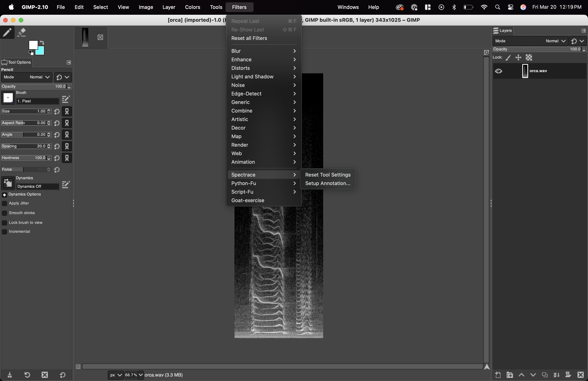
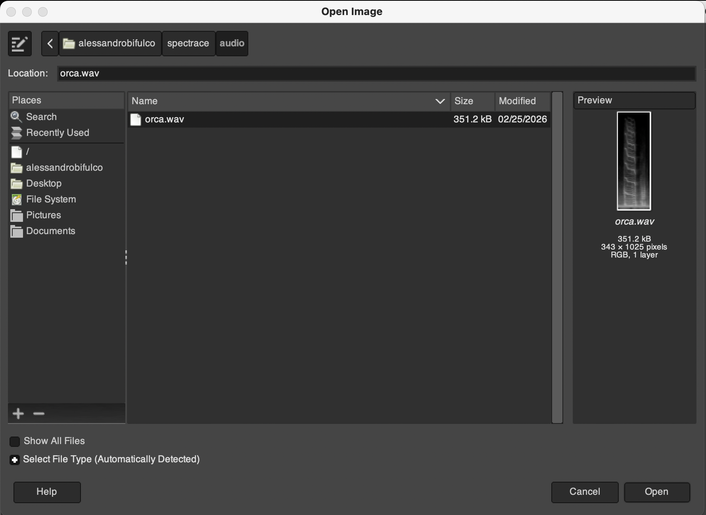

# Spectrace

A Python-based workflow for creating precise binary mask annotations on spectrograms using GIMP, designed primarily for bioacoustic research applications.

## Overview

Spectrace streamlines the process of annotating audio spectrograms by combining Python's audio processing capabilities with GIMP's intuitive layer-based drawing interface. The workflow allows researchers to:

1. Open a WAV file directly in GIMP (automatic spectrogram generation)
2. Draw detailed binary masks on spectrograms using GIMP's tools
3. Organize annotations using layer groups (e.g., fundamental frequency, harmonics, heterodynes)
4. Export annotations to multiple formats (XCF, HDF5, Excel)
5. Visualize and validate annotations programmatically

This tool is particularly useful for creating training datasets for machine learning models, analyzing vocalizations, or documenting acoustic features with pixel-level precision.

## Key Features

- **WAV File Handler**: Open WAV files directly in GIMP — the plugin automatically generates and loads the spectrogram (no command-line steps needed)
- **One-Click Annotation Setup**: `Filters > Spectrace > Setup Annotation` creates all 26 annotation layers, configures tools, and starts the background monitor
- **Tool Enforcement**: The plugin continuously enforces correct pencil settings (1px, hardness 100, dynamics off) so annotators cannot accidentally misconfigure the tools
- **Auto Color Switching**: Each annotation layer gets a unique foreground color automatically — switching layers changes the drawing color
- **Dynamic Templates**: Use any XCF file as a template, or fall back to the built-in orca template
- **Locked-Down UI**: The installer strips GIMP down to essentials (pencil + eraser only, minimal keyboard shortcuts) to prevent accidental operations
- **Multiple Export Formats**: Convert annotations to HDF5 for ML pipelines or Excel for spreadsheet analysis
- **Batch Visualization**: Generate overlay and individual layer visualizations across all projects
- **Binary Morphology Tools**: Included utilities for post-processing binary masks

---

## Installation

### Step 1: Install GIMP 2.10

> **IMPORTANT:** You must install GIMP version **2.10.x** — not GIMP 3.0 or later. The `gimpformats` Python library and the Spectrace plugin both require GIMP 2.10. **Do not upgrade to GIMP 3.0 if prompted.**

<!-- (PICTURE RECOMMENDED: Side-by-side showing GIMP 2.10 "About" dialog vs GIMP 3.0, with a checkmark on 2.10 and X on 3.0) -->

**macOS:**

Download the `.dmg` from the [Spectrace releases page](https://github.com/JacobGlennAyers/spectrace/releases/tag/correct_gimp_version) or [FossHub GIMP archive](https://www.fosshub.com/GIMP-old.html). Alternatively:

```bash
brew install gimp@2.10
```

**Windows:**

1. Download `gimp-2.10.30-setup.exe` from the [Spectrace releases page](https://github.com/JacobGlennAyers/spectrace/releases/tag/correct_gimp_version)
   - Alternative: [FossHub GIMP archive](https://www.fosshub.com/GIMP-old.html)
2. Run the installer and accept default settings

**Linux (Ubuntu/Debian):**

```bash
sudo apt update && sudo apt install gimp=2.10.*
```

If GIMP 2.10 is not in your distribution's repositories, use Flatpak:

```bash
flatpak install flathub org.gimp.GIMP//2.10
flatpak run org.gimp.GIMP//2.10
```

**After installing, launch GIMP once and then close it.** This creates the configuration directory that the Spectrace installer needs.

### Step 2: Clone the Repository and Create the Conda Environment

```bash
git clone https://github.com/JacobGlennAyers/spectrace.git
cd spectrace
conda env create -f environment.yml
conda activate spectrace
```

This installs all Python dependencies:

| Package | Purpose |
|---------|---------|
| librosa | Audio processing and spectrogram generation |
| numpy, pandas | Data manipulation |
| matplotlib | Visualization |
| gimpformats | Reading GIMP 2.10 XCF files |
| h5py | HDF5 file handling |
| pillow | Image processing |
| openpyxl | Excel export |
| scikit-learn | ML utilities |

### Step 3: Install the Spectrace GIMP Plugin

Run the installer (works on macOS, Linux, and Windows):

```bash
python gimp_plugin/install.py
```

The installer automatically:
1. Copies the plugin into GIMP's plug-ins directory
2. Installs a locked-down UI configuration (pencil + eraser only, minimal keyboard shortcuts)
3. Detects your conda `spectrace` environment and writes the path to `~/.spectrace/config.json`
4. Backs up your original GIMP configuration (restored when you uninstall)

> **Note:** The Linux installer auto-detects both standard (`~/.config/GIMP/2.10`) and Flatpak GIMP installations.

<!-- (PICTURE RECOMMENDED: Terminal screenshot showing successful install script output) -->

### Step 4: Verify the Installation

1. **Close GIMP completely** if it's open (the plugin only loads at startup)
2. **Reopen GIMP**
3. You should see a stripped-down interface: only Pencil and Eraser in the toolbox, only Tool Options and Layers panels
4. Right-click the canvas and check that `Filters > Spectrace` appears with two entries:
   - `Setup Annotation...`
   - `Reset Tool Settings`



If the Spectrace menu does not appear, see [Troubleshooting](#troubleshooting).

---

## Quick Start Guide

The Spectrace plugin eliminates all manual GIMP setup. The complete workflow is:

**Open WAV** &rarr; **Setup Annotation** &rarr; **Draw** &rarr; **Save**

### 1. Open Your WAV File in GIMP

1. In GIMP, go to `File > Open`
2. Navigate to your WAV audio file and select it
3. The plugin automatically:
   - Generates a spectrogram using librosa (via the `spectrace` conda environment)
   - Creates a project folder in `projects/` with the spectrogram PNG and metadata
   - Loads the spectrogram into GIMP as a new image



> **Tip:** You can open any WAV file from anywhere on your computer — it does not need to be in the `audio/` directory. The plugin will create the project folder for you automatically.

> **Note:** If you open the same WAV file again, the plugin reuses the most recent existing spectrogram instead of regenerating it. To create a new annotation pass for the same audio, see [Multiple Projects per Audio File](#multiple-projects-per-audio-file).

### 2. Set Up Annotation Layers

1. Right-click the canvas (or use the menu bar if visible)
2. Go to `Filters > Spectrace > Setup Annotation...`
3. A dialog appears asking for a **Template XCF file**:
   - **Leave it blank** to use the built-in orca template (26 layers for killer whale vocalizations)
   - **Or browse** to a custom template XCF file (see [Template Customization](#template-customization))
4. Click OK

<!-- (PICTURE RECOMMENDED: Screenshot of the Setup Annotation dialog, then the Layers panel showing all 26 created layers) -->

The plugin automatically:
- Creates the full annotation layer hierarchy (all 26 layers with correct grouping)
- Sets the Pencil tool to the correct settings (1px, hardness 100, dynamics off)
- Starts a background monitor that enforces tool settings and auto-switches foreground colors when you change layers

**You are now ready to draw.**

### 3. Draw Your Annotations

1. **Expand the layer group** in the Layers panel (click the `+` icon next to `OrcinusOrca_FrequencyContours`)
2. **Click on a layer** to select it (e.g., `f0_LFC` for fundamental frequency)
   - The foreground color changes automatically to that layer's assigned color
3. **Zoom in** for precision: use `View > Zoom > 2:1 (200%)` or scroll-wheel zoom

<!-- (PICTURE RECOMMENDED: Screenshot showing the expanded layer panel with a layer selected, and the foreground color matching that layer) -->

4. **Draw** along the frequency contour on the spectrogram
   - The Pencil tool is already configured — just draw
   - Use `Ctrl+Z` (`Cmd+Z` on Mac) to undo mistakes

5. **Switch to Eraser** when you need to correct:
   - Select the Eraser tool from the toolbox
   - The eraser size is adjustable (unlike the pencil, which is locked to 1px)
   - The plugin remembers your eraser size across tool switches

<!-- (PICTURE RECOMMENDED: Before/after showing a contour being drawn on the spectrogram, with the annotation visible as a colored line over the spectrogram) -->

**Drawing Tips:**

- Draw along the frequency contour you wish to annotate
- Switch layers by clicking layer names in the Layers panel — the color updates automatically
- Toggle layer visibility using the "eye" icon to check your work
- Start with the bottom layer in the list and work upward to avoid forgetting layers
- If the pencil stops working correctly, use `Filters > Spectrace > Reset Tool Settings`

**What to Draw:**

- Draw all contours that are within the onset and offset boundaries of the vocalization
- If multiple calls from the **same vocalization** are present, draw them all in one project
- If calls from **different individuals/vocalizations** are present, create separate projects for each

### 4. Save Your Work

1. `File > Save As...` (first time) or `Ctrl+S` (subsequent saves)
2. Save the XCF file in your project folder: `projects/your_audio_file_0/your_audio_file_0.xcf`
3. The XCF filename should match the project folder name

### GIF Demonstrations

These GIF demonstrations show the annotation workflow:

**Drawing contours:**


**Saving your work:**


---

## Managing Layers and Corrections

**If you drew on the wrong layer:**

1. Click on the layer with incorrect contours
2. Zoom out: `View > Zoom > 1:1 (100%)`
3. Select the Rectangle Select tool
4. Draw a rectangle around the contours to copy
5. Press `Ctrl+C` to copy
6. Click on the correct destination layer
7. Press `Ctrl+V` to paste
8. A "Floating Selection (Pasted Layer)" will appear — right-click it and select `Anchor Layer`
9. Erase any unwanted contours from the original layer

**Checking your work:**

Click the "eye" icons next to layers to toggle visibility — this helps verify each contour is on the correct layer.

<!-- (PICTURE RECOMMENDED: Screenshot showing the eye icon toggled off for one layer to reveal the annotation underneath) -->

---

## Post-Annotation: Visualization and Export

### Visualize Your Annotations

```bash
conda activate spectrace
python produce_visuals.py
```

Edit `produce_visuals.py` to set your audio file basename:

```python
clip_basename = "your_audio_file"  # without extension or index number
```

This creates overlay and individual layer visualizations in the `visualizations/` folder.

### Convert to HDF5 Format

For ML pipelines, convert XCF annotations to HDF5:

```bash
python xcf_to_hdf5.py
```

Edit `xcf_to_hdf5.py` to set paths:

```python
project_folder = "./projects"
ml_data_folder = "./hdf5_files"
```

This creates one HDF5 file **per audio clip** (consolidating all annotation passes) plus `dataset_index.csv`.

Each HDF5 file contains:
- `spectrogram`: Grayscale spectrogram array (H, W), stored once per clip
- `annotations/<index>/masks`: Binary masks array (C, H, W) per annotation set
- `annotations/<index>/`: Per-annotation attributes: `notes` (str) and `timing_drift` (bool)
- `metadata/`: Shared audio parameters (sample rate, nfft, noverlap, duration, etc.)
- `@class_names`: JSON list of annotation class names (root attribute)
- `@num_annotations`: Number of annotation sets in this file (root attribute)

### Loading HDF5 Data

```python
from hdf5_utils import HDF5SpectrogramLoader

with HDF5SpectrogramLoader("hdf5_files/orca_0.hdf5") as loader:
    # Load spectrogram, masks, and metadata for the first annotation set
    spec, masks, metadata = loader.load(annotation_index=0)
    class_names = loader.get_class_names()

    # Get specific class mask from a specific annotation set
    f0_mask = loader.get_class_mask("f0_LFC", annotation_index=0)

    # List all annotation sets in this file
    indices = loader.get_annotation_indices()  # e.g. [0, 1, 2]

    # Load masks for a different annotation set
    masks_v2 = loader.load_masks(annotation_index=1)

    # Check which classes have annotations (non-zero masks)
    non_empty = loader.get_non_empty_classes(annotation_index=0)
```

### Export to Excel

Convert annotations to Excel spreadsheets:

```bash
python export_contours_to_excel.py
```

Edit `export_contours_to_excel.py` to configure:

```python
ml_data_folder = "./hdf5_files"
output_excel = "whale_contours_export.xlsx"
contour_method = "centroid"  # or "min_max" or "all_points"
```

The Excel file contains:
- **Summary**: Overview of all samples
- **Contours**: Time-frequency points for each annotation
- **Statistics**: Per-annotation metrics (duration, bandwidth, etc.)
- **Class_Summary**: Aggregate statistics per class

Extraction methods:
- `"centroid"`: One frequency value per time frame (smoothest contours)
- `"min_max"`: Minimum and maximum frequency per time frame (captures bandwidth)
- `"all_points"`: Every pixel (most detailed, largest file)

---

## Reference

### Project Structure

Each project folder (created automatically when you open a WAV file) contains:

```
projects/
└── your_audio_file_0/
    ├── your_audio_file_0_spectrogram.png  # Spectrogram image
    ├── your_audio_file.wav                 # Copy of audio file
    ├── your_audio_file_0.xcf              # GIMP file with annotations
    ├── metadata.pkl                        # Project metadata
    └── metadata.csv                        # Human-readable metadata
```

### Layer Organization

The built-in orca template creates a hierarchical layer structure designed for killer whale vocalizations:

```
OrcinusOrca_FrequencyContours/
├── Heterodynes/
│   ├── unsure
│   ├── 0 (affiliated with f0 of HFC)
│   ├── 1 (affiliated with 1st harmonic of HFC)
│   ├── 2 (affiliated with 2nd harmonic of HFC)
│   └── ... (up to 12)
├── Subharmonics/
│   ├── subharmonics_HFC
│   └── subharmonics_LFC
├── heterodyne_or_subharmonic_or_other
├── Cetacean_AdditionalContours/
│   ├── unsure_CetaceanAdditionalContours
│   ├── harmonics_CetaceanAdditionalContours
│   └── f0_CetaceanAdditionalContours
├── harmonics_HFC
├── f0_HFC
├── unsure_HFC
├── harmonics_LFC
├── f0_LFC
└── unsure_LFC
```

**Key abbreviations:**
- **HFC** = High-Frequency Component (for biphonic calls)
- **LFC** = Low-Frequency Component (for biphonic calls or monophonic calls)
- **f0** = Fundamental frequency

**Usage notes:**
- For **biphonic calls**, use both HFC and LFC layer sets
- For **monophonic calls**, use only LFC layer sets
- Heterodynes are numbered according to which harmonic of the HFC they're affiliated with
- Use "unsure" layers when classification is ambiguous

The template is designed for killer whale (orca) vocalizations but can be adapted for other species. See `templates/orca_template.yaml` for complete documentation with scientific references.

The script increments the project index automatically (`your_audio_file_0`, `your_audio_file_1`, etc.).

### Color Mapping

The first time you visualize a project, Spectrace automatically:
- Discovers all layer names from your template or existing projects
- Assigns a unique color to each annotation class
- Saves the mapping to `layer_color_mapping.json`

This ensures consistent colors across all visualizations. To use a master template:

```python
template_xcf_path = "./templates/orca_template.xcf"
```

Or set to `None` to auto-discover from existing projects.

### Configuration File

The install script creates `~/.spectrace/config.json` (or `%USERPROFILE%\.spectrace\config.json` on Windows):

```json
{
  "spectrace_root": "/path/to/spectrace",
  "python3_path": "/path/to/conda/envs/spectrace/bin/python",
  "default_nfft": 2048,
  "default_grayscale": true,
  "default_project_dir": "projects"
}
```

| Setting | Description |
|---------|-------------|
| `spectrace_root` | Path to your cloned spectrace repository |
| `python3_path` | Path to the Python interpreter in the spectrace conda environment |
| `default_nfft` | FFT window size for spectrogram generation (higher = better frequency resolution, worse time resolution) |
| `default_grayscale` | Whether to generate grayscale spectrograms (recommended: `true`) |
| `default_project_dir` | Directory for project output (relative to `spectrace_root` or absolute) |

If the installer could not auto-detect your conda environment, you will need to set `python3_path` manually:

```bash
conda activate spectrace
which python    # macOS/Linux
where python    # Windows
```

Copy the output path into `~/.spectrace/config.json`.

---

## Template Customization

To create your own annotation template for a different species or use case:

1. Create a new XCF file in GIMP 2.10
2. Create a **top-level layer group** (e.g., `YourSpecies_FrequencyContours`)
3. Inside it, create subgroups and layers as needed
4. Save as `templates/your_template.xcf`
5. Optionally create a corresponding YAML file documenting each layer's purpose

When running `Setup Annotation`, browse to your template XCF — the plugin will dynamically extract the layer structure and generate unique colors for each layer.

**Note:** Templates created in GIMP 2.10 must be used exclusively with GIMP 2.10. Do not open or save them in GIMP 3.0.

---

## Binary Morphology Operations

The `demos/` folder includes examples of common binary morphology operations (erosion, dilation, opening, closing) for post-processing binary masks. These can clean up annotations, connect nearby regions, or extract specific features.

- `demos/binary_morphology_interactive.ipynb` — interactive Jupyter notebook examples
- `demos/bin_morph.py` — standalone demonstration script

---

## Troubleshooting

### Plugin Not Appearing in Filters Menu

- **Verify the plugin file is in the correct directory:**

  | Platform | Expected Location |
  |----------|-------------------|
  | macOS | `~/Library/Application Support/GIMP/2.10/plug-ins/spectrace_annotator.py` |
  | Linux | `~/.config/GIMP/2.10/plug-ins/spectrace_annotator.py` |
  | Linux (Flatpak) | `~/.var/app/org.gimp.GIMP/config/GIMP/2.10/plug-ins/spectrace_annotator.py` |
  | Windows | `%APPDATA%\GIMP\2.10\plug-ins\spectrace_annotator.py` |

- **Linux/macOS:** Ensure the file is executable: `chmod +x <path>/spectrace_annotator.py`
- **Did you restart GIMP?** The plugin only loads at startup — you must fully close and reopen GIMP.
- **Check GIMP version:** `Help > About` must show 2.10.x

### WAV File Won't Open / Spectrogram Not Generated

- The plugin calls the `spectrace` conda environment via subprocess. Check `~/.spectrace/config.json`:
  - Is `python3_path` pointing to a valid Python executable?
  - Is `spectrace_root` pointing to the correct directory containing `spectrace_wav_bridge.py`?
- Test manually: `conda activate spectrace && python spectrace_wav_bridge.py --wav /path/to/file.wav --output-dir ./projects --nfft 2048 --grayscale`
- Check the debug log at `/tmp/spectrace_debug.log` for detailed error messages

### Pencil Not Drawing

- Use `Filters > Spectrace > Reset Tool Settings` to force correct settings
- Make sure you clicked on a **layer** (not a layer group) in the Layers panel
- The plugin enforces settings automatically — if drawing still fails, check the debug log at `/tmp/spectrace_debug.log`

### Tool Options Look Wrong / Stale Values

The plugin sets tool parameters via GIMP's API, but the tool options panel display may not update visually. The tool *behaves* correctly. Click `Filters > Spectrace > Reset Tool Settings` if unsure.


### Python Packages Not Found

```bash
conda activate spectrace
conda env remove -n spectrace       # if corrupted
conda env create -f environment.yml  # reinstall
```


## Compatibility

| Component | Requirement |
|-----------|-------------|
| **GIMP** | 2.10.x only (NOT 3.0+) |
| **Python** | 3.11 (via conda environment) |
| **Operating Systems** | macOS, Linux (standard + Flatpak), Windows |
| **gimpformats** | Only supports GIMP 2.10 XCF format |
| **Plugin Python** | Uses GIMP 2.10's bundled Python 2.7 (separate from the conda environment) |

### File Formats

| Format | Purpose |
|--------|---------|
| **WAV** | Audio input (opened directly in GIMP via the plugin) |
| **XCF** | GIMP's native format (v2.10), stores all layers and annotations |
| **HDF5** | Hierarchical data format for ML pipelines |
| **PNG** | Spectrogram images and visualization outputs |
| **Excel** | Tabular export of contour data |
| **PKL/CSV** | Project metadata |

---

## Uninstalling

Run the uninstaller to remove the plugin and restore your original GIMP configuration:

```bash
python gimp_plugin/install.py --uninstall
```

This restores your original `gimprc`, `menurc`, `toolrc`, and `sessionrc` from the backups created during installation. Restart GIMP after uninstalling.

To also remove the spectrace configuration:

```bash
rm -rf ~/.spectrace  # macOS/Linux
```

## Contributing

See [CONTRIBUTING.md](CONTRIBUTING.md) for development setup, code style, and pull request guidelines.
